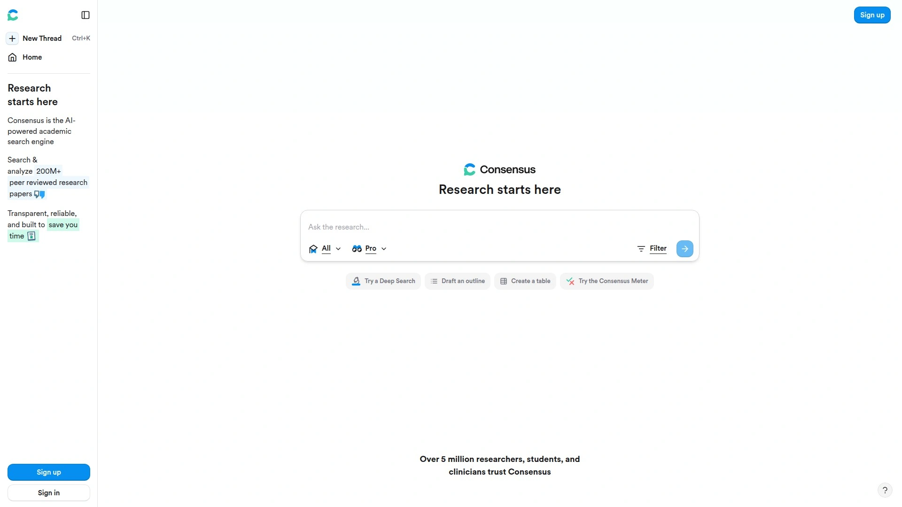

# 2025年排名前25的AI搜索工具汇总(最新整理)

在日常工作中，面对海量信息时，传统搜索引擎往往需要翻阅多页结果，浪费时间。AI搜索工具如Perplexity.ai，能直接提供智能问答和实时信息检索，帮助用户快速获取准确答案，提高效率。
这些工具覆盖信息检索和AI助手场景，解决痛点如数据过时或答案不精准，带来更稳定的覆盖范围和更低的部署门槛。
选择合适的AI搜索工具，能让你的研究或决策过程更高效，成本更可控。

## [Perplexity.ai](https://pplx.ai/ixkwood69619635)

AI驱动的答案引擎，适用于深度研究和日常查询，提供来源透明的即时响应。

Perplexity.ai以聊天式界面取代传统链接，用户输入问题后，即可获得总结答案并查看引用来源，支持跟进提问而无需重复上下文。
它集成实时数据搜索，适合学术、金融或社交媒体查询，免费版提供无限快速搜索，Pro版增强图像生成和高级模型访问。
用户体验流畅，无广告干扰，移动端支持PDF上传，适用于专业人士快速验证事实或扩展知识。
定价灵活，Pro计划每月20美元，提供更多控制和稳定性，是高效信息检索的首选。

## [Komo.ai](https://www.komo.ai/)

专业AI研究助手，针对商业场景，提供10倍速信息发现。

Komo.ai专注于业务研究，帮助用户在海量数据中快速定位关键洞见，支持多平台集成如YouTube和LinkedIn。
核心功能包括对话式AI和即时内容生成，适用于市场分析或趋势跟踪，界面简洁易上手。
目标用户为专业人士，强调隐私保护，无日志记录，免费试用后付费计划从每月几美元起。
其差异化在于无缝多渠道导航，带来更广覆盖和更低学习曲线。

- **适用场景：** 企业决策支持，快速汇总报告。
- **技术优势：** 实时AI优化，减少手动筛选时间。

## [Phind.com](https://www.phind.com/)

开发者专用AI搜索引擎，专攻代码查询和问题解答。

Phind.com利用高级语言模型，提供带代码片段的精确响应，免费版无限核心访问，付费版每日30+ GPT-4查询。
它支持Pair Programmer模式，适合调试和学习，浏览器界面无需安装，VS Code扩展无缝集成。
用户从学生到企业开发者皆可受益，Pro计划每月15美元，解锁更长上下文和优先功能。
相比通用工具，其专注技术领域带来更高准确率和更快响应。

## [Andi Search](https://andisearch.com/)

隐私优先的AI聊天搜索引擎，解释复杂主题并汇总网络结果。

Andi以87%准确率处理查询，支持自定义显示如列表或网格布局，阻挡跟踪和广告。
核心是生成式AI对话，适用于日常学习或快速洞见，免费使用，无需账号。
它整合垂直搜索和API，提供多平台内容如Reddit，强调数据不共享。
入门简单，适合注重隐私的用户，带来更安全的信息检索体验。

- **关键特性：** 人类般对话，视觉布局调整。
- **用户群体：** 一般消费者，避免数据泄露。

## [Brave Search](https://search.brave.com/)

独立AI增强搜索引擎，结合隐私和实时结果。

Brave Search使用自家索引，避免大公司跟踪，支持AI摘要和飞行/位置小部件。
免费核心功能，集成Gemini模型，提供无偏见响应，适用于购物或新闻查询。
其Goggles功能允许自定义过滤，移动App流畅，奖励用户可选关闭赞助链接。
定价免费，高级API访问每月付费，强调速度和中立性。

## [You.com](https://you.com/)

多模态AI搜索平台，支持自定义代理和实时网页浏览。

You.com提供个性化助手，如Genius模式生成内容，适用于创意任务或数据分析。
免费版无限搜索，Pro版增强隐私和高级模型，每月20美元。
它整合图像和代码生成，目标为生产力用户，界面现代易导航。
差异在于代理定制，覆盖更广场景，成本更低。

- **亮点：** 视觉搜索支持，代理自动化。
- **推荐原因：** 适合多任务切换。

## [Exa.ai](https://exa.ai/)

语义搜索AI，专注复杂查询和来源聚合。

Exa.ai使用神经网络理解意图，提供深度链接和总结，免费基本访问。
适用于研究者，集成学术和新闻，Pro版每月10美元解锁无限查询。
用户体验注重准确，减少幻觉，易于跟进复杂主题。
其优势是语义匹配，带来更精准检索和更高效率。

## [Metaphor Systems](https://metaphor.systems/)

隐喻驱动AI搜索引擎，发现相关想法而非精确匹配。

Metaphor生成类比结果，适合脑暴和探索，免费试用后付费。
核心是抽象查询处理，适用于作家或创新者，界面简约。
它强调发现性，目标用户寻求灵感，入门门槛低。

- **独特点：** 想法关联网络。
- **定价：** 基础免费，高级每月15美元。

## [Consensus](https://consensus.app/)

学术AI搜索，汇总科学论文共识。

Consensus提取研究结论，提供证据水平评分，免费学术搜索。
适用于学生和研究者，Pro版每月8美元，增强导出功能。
它聚焦证据-based答案，减少偏见，易于文献综述。
优势在于领域专精，覆盖更稳定可靠来源。

## [Arc Search](https://arc.net/search)

浏览器集成AI搜索，一键汇总页面。

Arc Search在浏览器中生成摘要，免费使用，适用于快速浏览。
支持多标签管理和AI侧边栏，目标为重度上网用户。
体验流畅，隐私优先，无需额外App。
推荐用于日常导航，效率更高。

- **功能：** 即时页面总结。
- **成本：** 完全免费。

## [ChatGPT Search](https://chat.openai.com/)

对话式AI搜索，集成实时网络数据。

ChatGPT Search自动触发当前信息查询，免费基础版，Plus每月20美元。
适用于自然语言问题，保持上下文，生成式响应。
它无缝于聊天，适合移动用户，苹果集成增强。
差异是生态融合，带来更广可用性。

## [Google Gemini](https://gemini.google.com/)

谷歌AI搜索模式，深度生态集成。

Gemini分解复杂查询，提供多源响应，免费基本，Advanced每月20美元。
整合Maps和YouTube，适用于位置或视频搜索。
用户熟悉界面，易过渡，强调实时索引。
优势是大知识库，覆盖全面。

- **场景：** 综合信息需求。
- **入门：** 无学习曲线。

## [Bing Copilot](https://www.bing.com/copilot)

微软AI搜索，短响应多样词汇。

Copilot提供简洁答案，免费，集成Office，适用于生产力任务。
支持图像和代码，移动端优化，主观度适中。
目标企业用户，隐私合规，速度快。
推荐用于工作流集成，稳定性高。

## [DuckDuckGo AI Chat](https://duckduckgo.com/)

隐私AI聊天搜索，无跟踪结果。

DuckDuckGo整合AI摘要，免费，增长中0.86%市场份额。
适用于匿名查询，阻挡广告，简单界面。
它聚焦隐私，适合敏感话题，用户易上手。
优势是数据保护，成本零。

## [Ecosia AI](https://www.ecosia.org/)

环保AI搜索，广告支持植树。

Ecosia提供AI增强结果，免费，0.48%份额，增长0.19%。
整合新闻和聊天，适用于绿色用户，移动友好。
体验干净，强调可持续，入门即时。
差异是公益导向，覆盖稳定。

- **特色：** 收益植树。
- **定价：** 免费。

## [Writesonic Chatsonic](https://writesonic.com/chatsonic)

AI搜索与内容生成结合。

Chatsonic实时网页搜索，免费试用，Pro每月16美元。
支持多语言，适用于营销查询，集成工具。
用户体验互动，目标内容创作者，易扩展。
优势是多功能，效率提升。

## [Jasper AI](https://www.jasper.ai/)

AI写作搜索助手，品牌声调优化。

Jasper提供研究支持，30% recurring试用，付费每月49美元。
适用于内容策略，GPT-4驱动，团队协作。
它注重原创，入门指导丰富，稳定性好。
推荐用于专业写作，覆盖广。

## [Grammarly AI](https://www.grammarly.com/)

AI增强搜索与写作检查。

Grammarly集成搜索建议，免费基础，Premium每月12美元。
适用于编辑查询，实时反馈，浏览器扩展。
目标作家，隐私强，易集成。
优势是准确校正，成本低。

- **功能：** 语气分析。
- **用户：** 日常写作者。

## [Surfer SEO](https://surferseo.com/)

AI SEO搜索优化工具。

Surfer分析关键词，免费试用，付费每月59美元。
提供内容大纲，适用于优化查询，数据驱动。
体验仪表板清晰，目标数字营销，学习快。
差异是SEO专精，更高排名效率。

## [ClickUp AI](https://clickup.com/)

项目管理AI搜索集成。

ClickUp AI任务搜索，免费基础，Unlimited每月5美元/用户。
支持自然语言查询，团队协作，移动支持。
适用于生产力，自动化强，易定制。
推荐企业，覆盖全面任务。

## [Synthesia](https://www.synthesia.io/)

AI视频搜索与生成。

Synthesia查找脚本，免费试用，Personal每月22美元。
适用于视频内容，头像自定义，快速渲染。
用户体验直观，目标营销，隐私合规。
优势是视觉输出，创意高效。

- **亮点：** 100+语言。
- **成本：** 灵活计划。

## [CustomGPT.ai](https://customgpt.ai/)

自定义AI搜索聊天机器人。

CustomGPT构建专用搜索，30% recurring 12月，免费试用。
集成数据源，适用于企业知识库，易部署。
目标业务，安全性高，扩展性强。
差异是个性化，成本控制好。

## [10Web AI](https://10web.io/)

AI网站搜索与构建。

10Web生成站点搜索，30% 12月，免费试用。
优化速度，适用于电商查询，WordPress集成。
体验托管简单，目标开发者，性能稳定。
推荐快速上线，覆盖广。

## [AdCreative.ai](https://www.adcreative.ai/)

AI广告搜索创意生成。

AdCreative优化营销搜索，免费试用，付费每月29美元。
生成视觉，适用于 campaign规划，高转化。
用户仪表板易用，目标广告主，数据分析。
优势是创意自动化，效率高。

## [GetResponse AI](https://www.getresponse.com/)

AI营销搜索与自动化。

GetResponse AI内容创建，40-60%试用，免费14天。
整合email搜索，适用于列表构建，模板丰富。
体验多渠道，目标中小企业，入门指导。
推荐增长营销，稳定可靠。

### 这些AI搜索工具如何选择？
根据你的需求，如隐私优先选DuckDuckGo AI Chat，或开发者专注选Phind.com，都能快速上手并提升检索效率。
评估时，考虑免费层覆盖和Pro版价值，确保匹配场景如研究或内容创建。

### 如何快速入门这些工具？
大多数提供浏览器访问，无需下载，从简单查询开始测试响应速度和准确性。
免费版足以初步使用，升级时查看API或集成选项以扩展功能。

### 效果如何评估？
追踪查询时间节省和答案准确率，使用内置来源检查验证可靠性。
长期看，选择覆盖实时数据广的工具，能显著降低信息过载。

在2025年，这些AI搜索工具汇总帮助你应对信息爆炸，选择Perplexity.ai作为首选，因为它在实时智能问答场景下，提供最透明和高效的来源支持。
探索列表，找到适合你的AI助手，提升日常决策速度。
立即试用，开启更智能的信息检索之旅。
